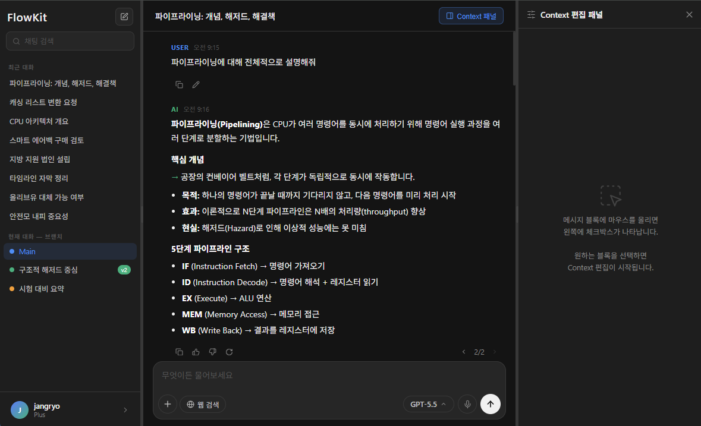
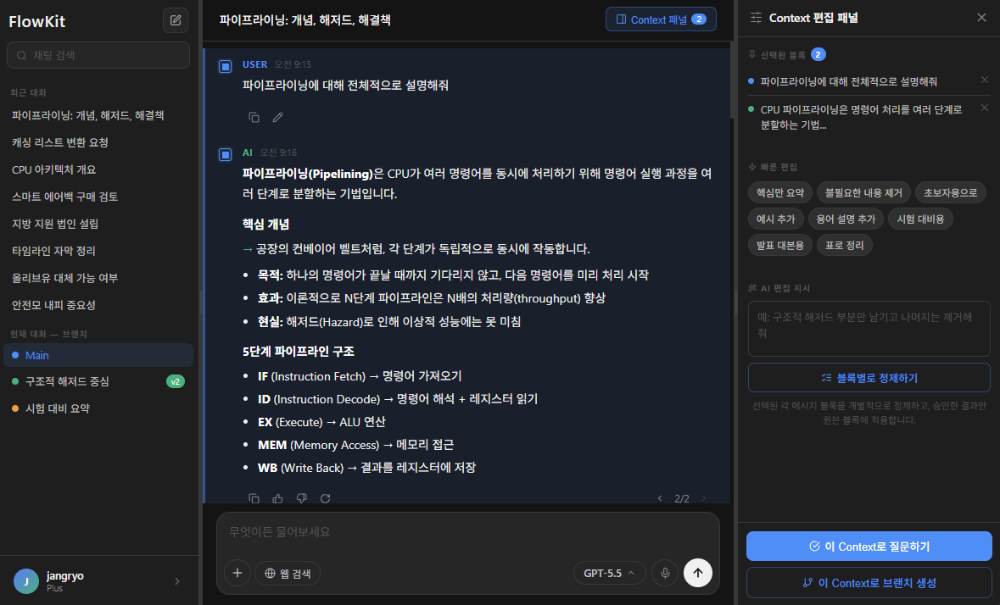
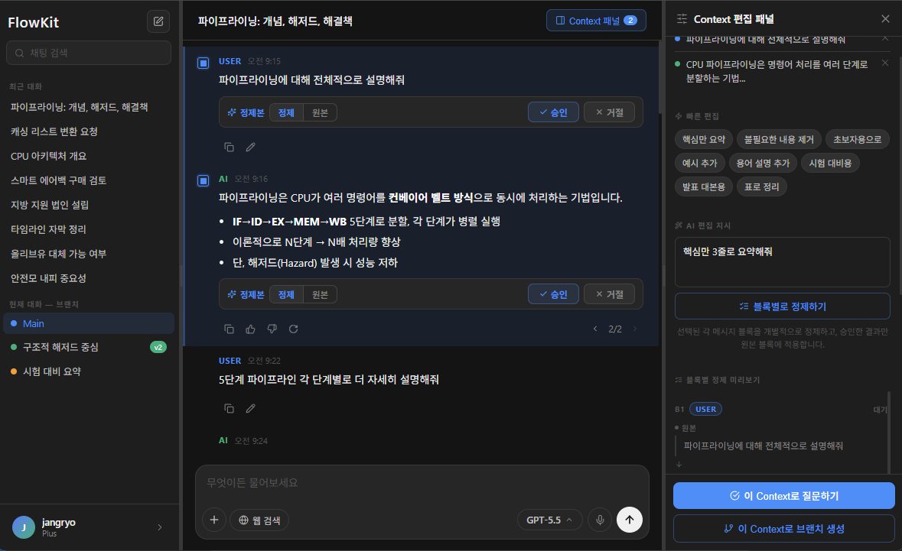
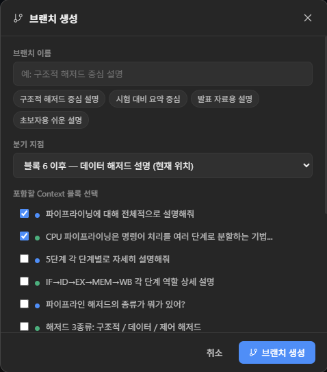
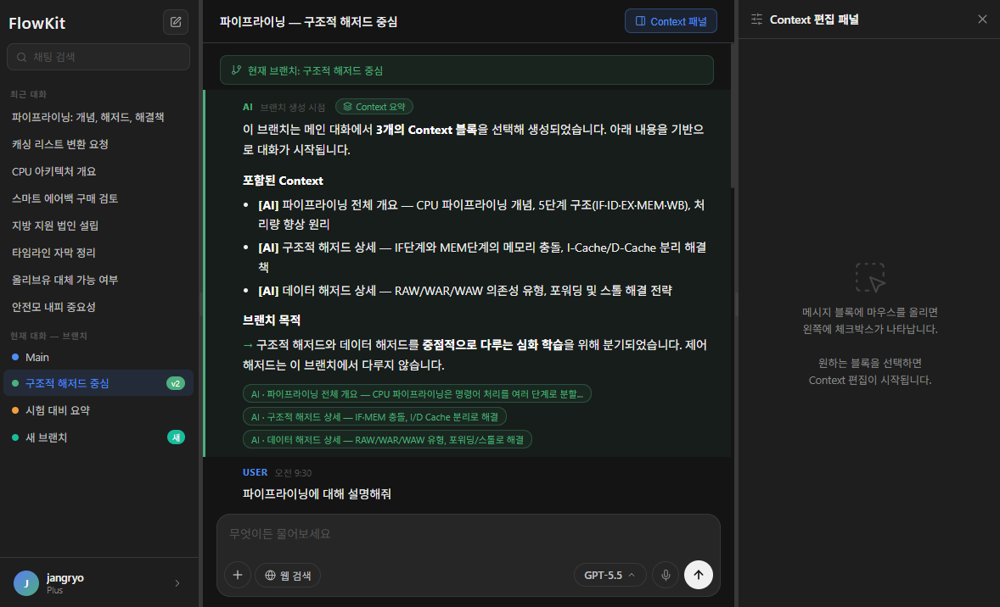
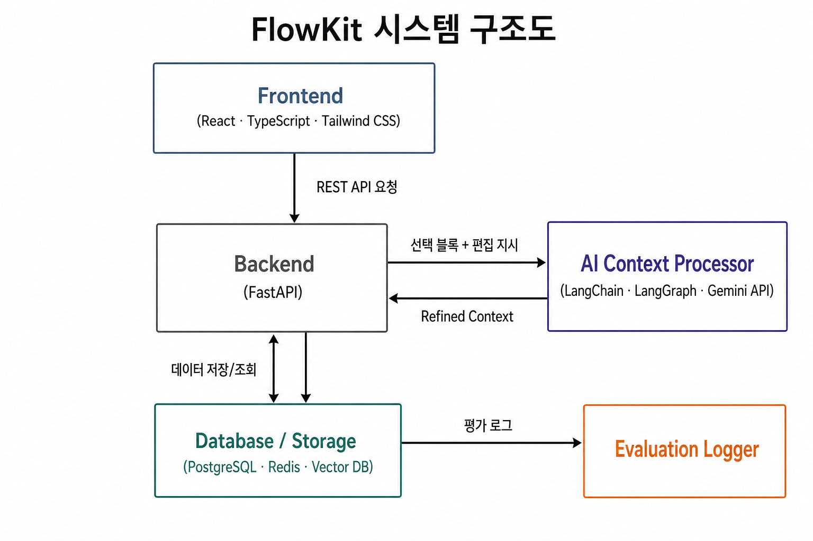
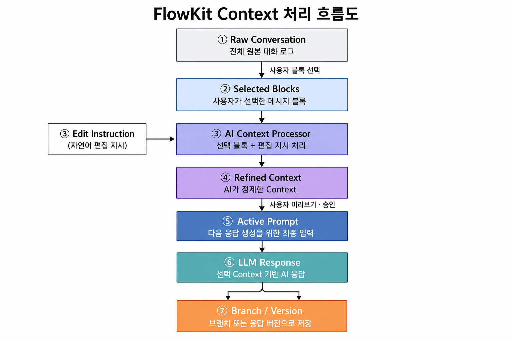

# FlowKit: 사용자 주도형 AI 대화 맥락 관리 서비스

류건호\*, 이호열\*, 홍준서\*, 조창현\*

\* 서울과학기술대학교 인공지능응용학과

**지도교수:** 서경원 교수 (서울과학기술대학교 인공지능응용학과)

서울과학기술대학교 | 2026년 6월

> **[보고서 안내]** 본 보고서는 FlowKit의 최종 구현 결과 보고서가 아니라, 캡스톤디자인(2)에서 실제 구현과 검증을 수행하기 위한 **기획·설계·검증 계획 보고서**이다. 실제 서비스 구현, 사용자 테스트, 정량·정성 평가는 캡스톤디자인(2)에서 수행한다.

---

**요 약** Conversational AI이 다양한 장기 작업에 광범위하게 활용되면서, 긴 다중 턴 대화에서 사용자가 AI의 맥락 처리를 직접 제어하기 어렵다는 문제가 대두되고 있다. 기존 Conversational AI은 이전 대화를 시간순으로 자동 누적하여 후속 응답에 반영하지만, 이 방식은 폐기된 아이디어나 읽지 않은 응답이 맥락으로 지속 반영되는 한계를 지닌다. 본 연구에서는 이러한 문제를 해결하기 위해 FlowKit을 제안한다. FlowKit은 대화를 메시지 블록(Message Block) 단위로 구조화하여, 사용자가 필요한 블록만 선택하고 자연어 지시로 Context를 정제한 뒤 후속 질문 또는 브랜치 생성에 적용할 수 있는 사용자 주도형 Context 관리 서비스이다. 캡스톤디자인(1)에서는 문제 정의, AS-IS/TO-BE 분석, 선행연구 조사, UI/UX 프로토타입 설계, 시스템 구조 설계, 요구사항정의서 작성, 평가 계획 수립을 완료하였으며, 캡스톤디자인(2)에서 실제 구현 및 검증을 수행할 예정이다.

**핵심어:** Context Engineering, 메시지 블록 선택, 대화 브랜치, 사용자 주도형 맥락 관리, HCI

---

# 목차

- Ⅰ. 서론
  - 1. 연구 배경 및 필요성
  - 2. 기존 Conversational AI의 한계
  - 3. 연구 목적 및 범위
  - 4. 보고서 구성
- Ⅱ. 관련 연구
  - 1. 선형 누적 Context의 실증적 한계
  - 2. Context를 조작 가능한 객체로 — 핵심 이론 기반
  - 3. 원본 로그와 활성 Context의 분리 — 시스템 구조 참고
  - 4. 대화 버전 관리와 선택형 브랜치
- Ⅲ. 시스템 설계
  - 1. 서비스 개요 및 AS-IS / TO-BE 분석
  - 2. 사용자 사용 흐름
  - 3. 핵심 기능 정의
  - 4. UI/UX 프로토타입 설계
  - 5. 시스템 구조 설계
  - 6. Context 처리 흐름
  - 7. 평가 계획
  - 8. 추진 일정
- Ⅳ. 결론
- References

---

# Ⅰ. 서론

## 1. 연구 배경 및 필요성

ChatGPT, Claude, Gemini 등 Conversational AI은 학습, 문서 작성, 정보 정리, 아이디어 기획 등 다양한 작업에 광범위하게 활용되고 있다. 사용자는 단순한 질의응답을 넘어 여러 차례의 대화를 거치며 개념을 학습하거나, 보고서 초안을 수정하거나, 여러 아이디어를 비교·발전시키는 방식으로 Conversational AI을 사용한다. 이에 따라 AI가 이전 대화 중 어떤 내용을 기억하고 후속 응답에 반영하는지가 중요한 문제가 되고 있다.

기존 Conversational AI은 일반적으로 사용자 입력과 AI 응답을 시간순 대화 기록으로 누적하고, 후속 질문이 들어오면 이전 대화의 상당 부분을 맥락(Context)으로 활용한다. 이 방식은 짧은 대화에서는 편리하지만, 대화가 길어질수록 사용자가 실제로 읽거나 수용한 내용과 AI가 후속 응답에 반영하는 내용 사이에 차이가 발생할 수 있다. 특히 사용자가 AI의 긴 응답 중 일부만 읽었거나 일부 내용만 필요하다고 판단했더라도, 기존 Conversational AI 구조에서는 응답 전체가 이후 대화의 암묵적 맥락으로 작동할 수 있다.

따라서 다중 턴 대화 환경에서는 AI가 더 많은 내용을 자동으로 기억하는 것보다, 사용자가 필요한 맥락을 선택하고 불필요한 맥락을 제외할 수 있는 구조가 필요하다.

## 2. 기존 Conversational AI의 한계

ChatGPT, Claude, Gemini 등 현재 주요 채팅 서비스에서는 AI가 어떤 Context를 기억하고 활용하는지 사용자가 직접 확인하거나 조정하기 어렵다. 사용자가 특정 설명은 제외하고 싶거나 일부 내용만 남기고 싶어도, 대화 전체가 하나의 선형 기록으로 누적되기 때문에 세밀한 제어가 어렵다.

또한 ChatGPT의 메시지 편집 기능 등 일부 서비스가 새 채팅 또는 대화 분기 기능을 제공하더라도, 대체로 특정 시점까지의 전체 대화를 기준으로 분기하는 방식에 가깝다. 이 경우 사용자는 이전 대화 중 필요한 일부 의미 단위만 선택하여 새로운 대화 흐름으로 이어가기 어렵다. 결과적으로 사용자는 잘못된 응답, 폐기된 아이디어, 읽지 않은 설명이 이후 대화에 계속 반영되는 상황을 직접 통제하기 어렵다.

ChatGPT의 Memory 기능이나 Claude의 Projects 기능은 AI가 특정 정보를 장기적으로 기억할 수 있게 한다는 점에서 맥락 관리의 필요성을 인식한 시도이다. 그러나 이들은 AI가 자동으로 요약·저장하는 방식에 기반하며, 사용자가 개별 메시지 블록 단위로 어떤 내용을 다음 응답에 반영할지 직접 선택·정제하는 구조가 아니다. 사용자는 어떤 대화 내용이 AI의 맥락으로 기억되는지 실시간으로 확인하거나, 특정 대화 단위만 선택하여 다음 응답의 맥락으로 지정하는 세밀한 제어를 하기 어렵다. FlowKit은 이러한 기존 서비스들과 달리, 맥락 구성의 주도권 자체를 사용자에게 명시적으로 이전하는 방식을 택한다.

선행연구 역시 긴 Context를 단순히 많이 제공하는 방식의 한계를 지적한다. Liu et al.[3]은 긴 Context 내부에서 관련 정보의 위치에 따라 LLM의 활용 성능이 달라질 수 있음을 보였으며, 이는 전체 대화 기록을 그대로 후속 응답에 반영하는 방식이 항상 최선이 아님을 설명하는 근거가 된다. Laban et al.[4]은 다중 턴 대화에서 모델이 초기 가정이나 이전 응답에 과도하게 의존할 수 있음을 지적하였다. 이러한 연구들은 긴 대화 환경에서 사용자가 필요한 Context를 선택·정제·확인한 뒤 후속 응답에 반영하는 구조의 필요성을 뒷받침한다.

## 3. 연구 목적 및 범위

FlowKit은 기존 Conversational AI의 선형적 Context 누적 문제를 해결하기 위해 제안된 사용자 주도형 AI 대화 맥락 관리 서비스이다. FlowKit은 대화를 메시지 블록(Message Block) 단위로 나누고, 사용자가 필요한 블록만 선택하여 다음 대화의 Context로 활용할 수 있게 한다. 선택된 블록은 Context 편집 패널에서 확인할 수 있으며, 사용자는 요약, 삭제, 재작성 등의 자연어 지시를 통해 Context를 정제할 수 있다. 이후 정제된 Context를 미리보기로 확인한 뒤, 해당 Context만 기반으로 후속 질문을 이어가거나 새로운 브랜치를 생성할 수 있다.

FlowKit의 설계 방향은 Context를 사용자가 조작 가능한 상호작용 객체로 보아야 한다는 Mixed-Initiative Context 연구[1]와도 연결된다. FlowKit은 LLM 모델 자체를 새로 학습시키는 프로젝트가 아니라, 사용자 인터페이스 차원에서 Context를 명시화하고, 선택·편집·분기할 수 있도록 하는 HCI 기반 Context 관리 서비스이다.

본 프로젝트의 최종 목표는 사용자가 Conversational AI의 대화 맥락을 직접 선택·편집·관리할 수 있는 서비스를 개발하는 것이다. 캡스톤디자인(1)에서는 문제 정의, 선행연구 조사, UI/UX 프로토타입 설계, 시스템 구조 설계, 요구사항정의서 작성, 평가 계획 수립을 완료하였고, 캡스톤디자인(2)에서 실제 구현과 사용자 검증을 수행한다.

## 4. 보고서 구성

본 보고서는 다음과 같이 구성된다. Ⅱ장에서는 FlowKit의 설계 근거가 되는 선행연구를 기술한다. Ⅲ장에서는 AS-IS/TO-BE 분석, 사용자 사용 흐름, 핵심 기능 정의, UI/UX 설계, 시스템 구조, Context 처리 흐름, 평가 계획, 추진 일정을 상세히 기술한다. Ⅳ장에서는 연구 요약, 활용 분야, 향후 확장 가능성을 제시한다.

---

# Ⅱ. 관련 연구

FlowKit의 설계는 세 가지 연구 축에 기반한다. 첫째, 대화 기록 전체를 그대로 Context로 사용하는 방식이 실제로 문제를 야기한다는 실증 근거, 둘째, Context를 사용자가 직접 선택·편집할 수 있는 상호작용 객체로 재정의한 이론적 기반, 셋째, 선형 대화를 분기 가능한 구조로 관리하는 대화 버전 관리 연구가 그것이다. 이 절에서는 세 축의 논문들을 흐름에 따라 검토하며, 각 연구가 FlowKit의 어느 문제의식 또는 설계 결정과 연결되는지를 설명한다.

## 1. 선형 누적 Context의 실증적 한계

FlowKit의 출발점은 "긴 대화를 그대로 Context로 넣는 것이 항상 최선은 아니다"라는 주장이다. 이를 뒷받침하는 가장 신뢰할 수 있는 근거는 Liu et al.[3]과 Laban et al.[4]이 각각 다른 차원에서 제시한 두 가지 실증 결과다.

Liu et al.[3]은 긴 Context를 처리할 수 있는 LLM이라도, 관련 정보가 Context의 중간 부분에 위치할 때 성능이 저하되는 "Lost in the Middle" 현상을 실험적으로 보고하였다. 이 연구는 context window가 충분히 크더라도 입력된 정보가 균등하게 반영되지 않을 수 있음을 입증한 peer-reviewed 논문(TACL 2024)으로, 긴 대화 기록 전체를 Context로 제공하는 방식이 항상 최선이 아님을 정량적으로 보여준다.

Laban et al.[4]은 여기서 한 단계 더 나아간다. 동일한 요구사항을 단일 턴에 제공받는 경우와 여러 턴에 걸쳐 점진적으로 드러나는 경우를 비교하면, 다중 턴 대화에서 모델이 초기 가정이나 이전 응답에 과도하게 의존하며 응답 품질이 저하될 수 있음을 보였다. Liu et al.이 "긴 Context 내부의 위치 문제"를 다루었다면, Laban et al.은 "대화가 누적되는 시간 축의 문제"를 다루었다고 볼 수 있다.

이 두 연구는 서로 다른 차원에서 동일한 방향을 가리킨다. 기존 Conversational AI처럼 대화 전체를 선형적으로 누적하는 방식은, Context의 양적 증가가 오히려 응답 품질과 초점성에 부정적 영향을 줄 수 있다는 것이다. FlowKit이 사용자가 필요한 블록만 선택하여 불필요한 맥락 노이즈를 제거하는 구조를 택한 것은 이 실증 결과에 직접적으로 반응한 설계 결정이다.

## 2. Context를 조작 가능한 객체로 — 핵심 이론 기반
FlowKit의 설계 원리를 가장 직접적으로 이론화한 연구는 Li et al.[1]의 Mixed-Initiative Context이다. 이 연구는 Human-AI Collaboration 환경에서 Context를 숨겨진 모델 입력이 아닌, **사용자가 직접 포함·제외·수정·재조직할 수 있는 명시적 상호작용 객체(interactive artifact)**로 재정의한다. AI는 브랜치 제안이나 패턴 추출 등을 통해 사용자를 보조하되, Context의 최종 구성 권한은 사용자에게 있어야 한다는 것이 이 연구의 핵심 주장이다.

이 개념은 FlowKit의 각 기능과 거의 일대일로 대응된다. 메시지 블록 선택은 Context unit의 포함·제외에, Context 편집 패널은 Context를 가시적·조작 가능하게 만드는 인터페이스에, 자연어 편집 지시는 사용자 주도 Context 재조직에, 정제 결과 미리보기 후 적용은 AI 제안을 사용자가 승인하는 Mixed-Initiative 구조에 각각 대응한다. FlowKit은 이 개념적 프레임을 Conversational AI 서비스 수준의 프로토타입으로 구현하고자 한다.

Human-in-the-loop 설계의 필요성은 Tso et al.[6]의 연구가 보조적으로 지지한다. 이 연구는 최신 LLM도 제약 조건이 포함된 작업에서 사용자 의도를 안정적으로 만족하지 못하는 경우가 있음을 벤치마크로 보였다. FlowKit에서 AI가 생성한 정제 Context를 자동으로 반영하지 않고, 사용자가 미리보기로 확인·승인한 뒤에만 적용하는 단계를 설계한 근거가 여기서도 확인된다.

## 3. 원본 로그와 활성 Context의 분리 — 시스템 구조 참고

이론적 원리를 구현하려면 내부 데이터 구조도 이를 뒷받침해야 한다. Packer et al.[5]의 MemGPT는 운영체제의 메모리 계층 구조를 LLM에 적용하여, 전체 대화 로그(long-term storage)와 LLM에 실제 전달되는 맥락(in-context storage)을 분리 관리하는 virtual context management 구조를 제안하였다. 전체 기록을 보존하면서도 활성 Context를 효율적으로 조정할 수 있음을 보인 이 연구는 FlowKit의 시스템 설계에 구조적 선례를 제공한다.

FlowKit 역시 Raw Conversation(원본 대화 로그)과 Active Prompt(다음 LLM 응답에 실제 반영되는 맥락)를 분리하는 구조를 채택한다. 다만 MemGPT가 시스템이 자동으로 메모리를 관리하는 agent-managed 구조라면, FlowKit은 사용자가 직접 어떤 블록을 Active Prompt에 포함할지 결정하는 user-managed 구조라는 것이 핵심 차이다. 이 차이는 앞 절에서 설명한 Mixed-Initiative Context 원리를 시스템 구조 차원에서 구현하는 방식이기도 하다.

## 4. 대화 버전 관리와 선택형 브랜치

Context를 사용자가 선택·정제한다면, 그 Context를 기반으로 새로운 대화 흐름을 분기하는 것도 자연스러운 확장이다. Nanjundappa and Maaheshwari[2]의 ContextBranch는 LLM 대화에 소프트웨어 버전 관리 개념을 적용하여, checkpoint, branch, switch, inject라는 네 가지 기본 연산을 제안하였다. 이 연구는 선형 대화가 누적될수록 context pollution이 발생하며, 사용자가 새 채팅을 시작하면 오히려 유용한 맥락까지 잃는다는 딜레마를 구조적으로 지적한다.

FlowKit의 선택 Context 기반 브랜치 생성은 이 연구에서 직접적인 설계 근거를 가져온다. ContextBranch가 특정 checkpoint까지의 전체 대화를 기준으로 브랜치를 구성하는 방식이었다면, FlowKit은 사용자가 선택한 의미 단위의 메시지 블록만을 기반으로 새로운 대화 흐름을 생성한다. "무엇을 기준으로 브랜치를 만드는가"라는 질문에 대한 FlowKit의 답변이 바로 이 지점이다. 또한 ContextBranch가 탐색적 프로그래밍 시나리오에 집중하였다면, FlowKit은 학습, 문서 작성, 정보 정리 등 일상적인 장기 대화 전반으로 그 적용 범위를 확장한다.

이상 네 편의 연구는 각기 다른 층위에서 FlowKit을 지지한다. Liu et al.과 Laban et al.은 문제의 존재를 실증하고, Li et al.은 핵심 설계 원리를 이론화하며, Packer et al.은 내부 데이터 구조의 선례를 제공하고, Nanjundappa et al.은 브랜치 기능의 구조적 기반이 된다. FlowKit은 이 연구들이 각각 분리되어 다루었던 문제의식과 해법을 하나의 사용자 인터페이스로 통합하고자 하는 시도이다.

---

# Ⅲ. 시스템 설계

## 1. 서비스 개요 및 AS-IS / TO-BE 분석

본 장에서는 Ⅱ장의 선행연구를 바탕으로 FlowKit의 구체적인 서비스 구조와 시스템 설계를 기술한다. FlowKit은 Conversational AI의 이전 대화 맥락을 사용자가 직접 선택·편집·분기할 수 있게 해주는 사용자 주도형 Context 관리 서비스이다.

### 1.1) AS-IS: 기존 Conversational AI의 한계

기존 Conversational AI의 대화 구조는 선형적이다. 사용자의 질문과 AI의 응답이 시간순으로 쌓이고, 후속 질문은 이전 대화 기록을 기반으로 처리된다. 이 방식은 짧은 대화에서는 자연스럽지만, 대화가 길어질수록 사용자가 원하지 않은 정보가 후속 응답에 영향을 줄 수 있다. 또한 사용자는 AI가 현재 어떤 Context를 기억하고 있는지 확인하거나, 특정 정보만 남기고 특정 정보는 제외하는 방식으로 세밀하게 제어하기 어렵다.

### 1.2) TO-BE: FlowKit의 사용자 주도형 구조

FlowKit은 이러한 문제를 해결하기 위해 대화 기록을 선택 가능한 Message Block 단위로 구조화한다. 사용자는 전체 대화가 아니라 필요한 블록만 선택하고, 선택된 블록을 Context 편집 패널에서 정제한 뒤 다음 질문에 적용한다. 또한 특정 시점까지의 전체 대화를 기준으로 분기하는 것이 아니라, 사용자가 선택한 의미 단위의 Context를 기준으로 새로운 브랜치를 생성한다.

| 구분          | 일반 Conversational AI         | FlowKit               |
| ----------- | ------------- | --------------------- |
| 이전 대화 처리    | 전체 대화를 자동 반영  | 필요한 메시지 블록만 선택        |
| Context 가시성 | 사용자가 확인하기 어려움 | Context 편집 패널에서 확인 가능 |
| 긴 응답 처리     | 응답 전체가 그대로 누적 | 요약·삭제·재작성 가능          |
| 대화 분기       | 특정 시점 기준 분기   | 선택 Context 기준 분기      |
| 사용자 제어권     | 낮음            | 높음                    |
| 핵심 가치       | 답변 생성         | 맥락 관리와 대화 흐름 제어       |

**표 1.** 일반 Conversational AI과 FlowKit의 구조 비교

## 2. 사용자 사용 흐름

> 본 절은 **사용자 조작 관점**의 흐름을 기술한다. 동일한 흐름을 시스템 내부 데이터 처리 관점으로 기술한 내용은 6절을 참조한다.

FlowKit의 기본 사용 흐름은 다음과 같다.

첫째, 사용자는 일반 Conversational AI처럼 질문을 입력한다. 둘째, 생성된 대화는 Message Block 단위로 표시된다. 셋째, 사용자는 후속 대화에 반영하고 싶은 사용자 질문 또는 AI 응답 블록을 선택한다. 넷째, 선택된 블록은 우측 Context 편집 패널에 모이며, 사용자는 현재 어떤 내용이 다음 질문의 맥락으로 사용될지 확인한다. 다섯째, 사용자는 자연어 지시 또는 빠른 편집 버튼을 통해 선택된 Context를 정제한다. 여섯째, 정제된 Context를 미리보기로 확인한 뒤 후속 질문에 적용하거나 별도의 브랜치를 생성한다.

| 단계 | 사용자 행동               | 시스템 처리                |
| -- | -------------------- | --------------------- |
| 1  | 질문 입력                | AI 응답 생성              |
| 2  | 필요한 메시지 블록 선택        | 선택 블록을 Context 후보로 저장 |
| 3  | Context 편집 패널 확인     | 선택된 블록 목록 표시          |
| 4  | 자연어 편집 지시 입력         | 선택 Context 요약·삭제·재작성  |
| 5  | 정제 Context 미리보기 확인   | 적용 전 결과 표시            |
| 6  | Context 적용 또는 브랜치 생성 | 후속 질문 또는 새 대화 흐름에 반영  |

**표 2.** FlowKit 사용자 사용 흐름 단계

## 3. 핵심 기능 정의

FlowKit의 핵심 기능은 기본 채팅 기능, 메시지 블록 선택 기능, Context 편집 기능, AI 기반 Context 정제 기능, 선택 Context 기반 브랜치 생성 기능, 이전 메시지 수정 및 답변 버전 관리 기능으로 구성된다.

기본 채팅 및 Message Block 구조는 사용자 질문과 AI 응답을 각각 독립적인 메시지 블록으로 저장하는 기능이다. Context 편집 패널은 사용자가 선택한 블록을 모아 보여주고, 후속 응답에 반영할 Context를 확인할 수 있게 한다. AI 기반 Context 정제 기능은 선택된 블록을 사용자의 자연어 지시에 따라 요약·삭제·재작성하는 기능이다. Context 적용 기능은 정제된 Context를 다음 질문의 활성 맥락으로 반영하는 기능이다. 선택 Context 기반 브랜치 생성 기능은 전체 대화가 아니라 사용자가 선택한 메시지 블록 또는 정제 Context를 기준으로 새 대화 흐름을 생성하는 기능이다. 이전 메시지 수정 및 답변 버전 관리 기능은 대화 흐름이 잘못되었을 때 전체 대화를 새로 시작하지 않고 특정 지점만 교정할 수 있게 한다.

| 우선순위 | 기능                       | 설명                          | 구현 방향            |
| ---: | ------------------------ | --------------------------- | ---------------- |
|    1 | 기본 채팅 및 Message Block 구조 | 사용자 질문과 AI 응답을 블록 단위로 저장·표시 | 메시지 블록 데이터 구조 구현 |
|    2 | Context 편집 패널            | 선택된 블록을 모아 보여주고 편집 가능하게 함   | 우측 패널 UI 구현      |
|    3 | AI 기반 Context 정제         | 선택 Context를 요약·삭제·재작성       | LLM API 연동       |
|    4 | Context 적용               | 정제된 Context를 후속 질문에 반영      | 활성 Context 상태 관리 |
|    5 | 선택형 브랜치 생성               | 선택 Context 기반 새 대화 흐름 생성    | 브랜치 저장 및 전환 구현   |
|    6 | 메시지 수정 및 버전 관리           | 이전 메시지 수정, 응답 재생성, 버전 비교    | 버전 히스토리 구현       |
|    7 | Self-Correction          | 정제 Context의 논리적 모순 검토       | 고도화 후보 기능        |
|    8 | RAG / 외부 문서 연동           | 외부 문서 기반 Context 확장         | 핵심 기능 안정화 이후 적용  |

**표 3.** FlowKit 핵심 기능 우선순위 및 구현 방향

캡스톤디자인(1)에서는 위 기능 분류를 바탕으로 요구사항정의서를 작성하였다. 요구사항정의서는 기능 요구사항(REQ) 65개 항목과 비기능 요구사항(NFR) 19개 항목으로 구성되며, 각 요구사항에 대해 수용 기준, 입출력 명세, 우선순위를 정의하였다. 비기능 요구사항에는 3단 화면 구조의 직관성, 인라인 정제 검토 흐름의 명확성, 승인 즉시 적용에 따른 단계 최소화 등 핵심 UX 원칙이 포함된다.

요구사항정의서에서 정의된 MVP 필수 요구사항은 다음 다섯 가지 기능 영역으로 구성된다.

| 기능 영역 | MVP 핵심 내용 |
| --- | --- |
| 메시지 블록 선택·패널 반영 | 블록 선택·해제, 선택 블록의 우측 Context 편집 패널 반영 |
| 블록별 Context 정제 | 개별 블록 정제, 원본/정제본 비교, 인라인 표시, 원본/정제본 토글 |
| 정제 결과 승인·거절·적용 | 블록 단위 승인 및 즉시 적용, 승인 취소, 거절, 인라인 승인/거절, 전체 승인 후 패널 자동 해제 |
| Context 미리보기·적용 | 정제된 Context 미리보기, 선택 Context 기반 후속 질문 적용 |
| 브랜치 생성 및 버전 이력 | 선택 Context 기반 브랜치 생성, 원본 버전 이력 보존, 미승인 블록 원본 복원 |

**표 3-MVP.** FlowKit MVP 필수 요구사항 기능 영역

## 4. UI/UX 프로토타입 설계

FlowKit의 UI/UX는 좌측 사이드바, 중앙 채팅 영역, 우측 Context 편집 패널의 3단 구조를 기본으로 한다.

좌측 사이드바는 전체 대화와 브랜치를 관리하는 영역이다. 중앙 채팅 영역은 사용자와 AI의 대화가 표시되는 핵심 영역으로, 각 사용자 질문과 AI 응답은 Message Block 단위로 표시된다. 우측 Context 편집 패널은 FlowKit의 핵심 조작 영역으로, 선택된 블록 목록, 빠른 편집 버튼, AI 편집 지시 입력창, 정제된 Context 미리보기, Context 적용 버튼, 브랜치 생성 버튼을 제공한다.

| 영역            | 구성 요소                     | 역할                  |
| ------------- | ------------------------- | ------------------- |
| 좌측 사이드바       | 최근 대화, 브랜치 목록, 새 채팅 버튼    | 대화 흐름 및 브랜치 관리      |
| 중앙 채팅 영역      | 사용자 질문, AI 응답, 블록 체크박스    | 메시지 블록 선택           |
| 우측 Context 패널 | 선택 블록, 편집 지시, 미리보기, 적용 버튼 | Context 정제 및 적용     |
| 입력창 영역        | 적용 중인 Context 표시, 질문 입력   | 선택 Context 기반 후속 질문 |

**표 4.** FlowKit UI 영역별 구성 요소

캡스톤디자인(1)에서는 이러한 화면 구조를 HTML 기반 프로토타입으로 제작하였다. 이 프로토타입을 통해 좌측 대화·브랜치 목록, 중앙 메시지 블록 기반 채팅 영역, 우측 Context 편집 패널, Context 적용 상태 표시, 브랜치 생성 모달, 메시지 수정 및 버전 관리 흐름을 시각적으로 구체화하였다.

**그림 1.** FlowKit 전체 화면 — 좌측 사이드바, 중앙 메시지 블록 기반 채팅 영역, 우측 Context 편집 패널이 함께 보이는 전체 서비스 화면이다.

**그림 2.** 메시지 블록 선택 및 Context 편집 패널 활성화 화면 — 사용자 질문과 AI 응답이 Message Block 단위로 구분되고, 선택된 블록이 우측 Context 편집 패널에 반영된 화면이다.

**그림 3.** 블록별 정제 및 인라인 승인/거절 화면 — AI가 생성한 정제본이 원본 블록 위치에 인라인으로 표시되며, 사용자가 승인/거절 버튼을 통해 Context 반영 여부를 직접 결정한다.

**그림 4-1.** 선택 Context 기반 브랜치 생성 모달 — 브랜치 이름 입력, 분기 지점 선택, 포함할 Context 블록 선택 기능이 하나의 모달에 구성된 화면이다.

**그림 4-2.** 브랜치 생성 결과 및 Context 요약 화면 — 생성된 브랜치 진입 시 해당 브랜치의 출발 Context가 상단에 요약 블록으로 표시된다.

## 5. 시스템 구조 설계

FlowKit의 시스템 구조는 캡스톤디자인(2) 구현을 염두에 두고 Frontend, Backend, AI Context Processor, Database / Storage, Evaluation Logger로 나누어 설계하였다. 캡스톤디자인(1) 단계에서는 각 모듈의 역할과 데이터 흐름을 정의하고, 기능 요구사항에 따라 적용 가능한 기술 후보를 도출하였다.

Frontend는 사용자 인터페이스를 담당한다. Backend는 서비스 로직과 API를 담당하며 사용자 대화, 메시지 블록, 선택 Context, 브랜치, 응답 버전 정보를 관리한다. AI Context Processor는 선택된 메시지 블록과 사용자의 편집 지시를 바탕으로 정제 Context를 생성하고, 최종적으로 LLM에 전달할 active prompt를 구성한다. Database / Storage는 원본 대화 로그, 메시지 블록, 선택된 Context, 정제된 Context, 브랜치 정보, 응답 버전 정보를 저장한다. Evaluation Logger는 캡스톤디자인(2)의 평가를 위해 사용자의 블록 선택 수, 정제 전후 Context 길이, 브랜치 생성 여부, 응답 시간, 사용자 평가 결과 등을 기록한다.

**그림 5.** FlowKit 시스템 구조도 — Frontend, Backend, AI Context Processor, Database / Storage, Evaluation Logger의 관계를 나타낸다.

| 모듈                   | 역할                     | 주요 데이터                   |
| -------------------- | ---------------------- | ------------------------ |
| Frontend             | UI 표시 및 사용자 조작 처리      | 선택 블록, 입력값, 화면 상태        |
| Backend              | API 및 서비스 로직 처리        | 대화, 브랜치, 사용자 요청          |
| AI Context Processor | Context 정제 및 prompt 구성 | 선택 블록, 편집 지시, 정제 Context |
| Database / Storage   | 데이터 저장                 | 메시지 블록, 브랜치, 버전          |
| Evaluation Logger    | 평가 로그 수집               | token 수, 선택 수, 응답 품질 평가값 |

**표 5.** FlowKit 시스템 모듈별 역할

### 5.1) 기술 스택

기술 스택은 다음과 같이 확정 후보, 검토 후보, 예정 기술로 구분하였다.

| 영역              | 후보 기술                           | 상태    | 활용 목적                                     |
| --------------- | ------------------------------- | ----- | ----------------------------------------- |
| Frontend        | React, TypeScript, Tailwind CSS | 검토/예정 | 메시지 블록 기반 채팅 UI, Context 편집 패널, 브랜치 목록 구현 |
| UI 시각화          | React Flow                      | 검토    | 향후 Context 흐름 또는 브랜치 구조 시각화에 활용           |
| Backend         | FastAPI                         | 확정 후보 | 사용자 요청 처리, 대화·브랜치·Context API 설계          |
| AI Workflow     | LangChain, LangGraph            | 검토/예정 | Context 정제, Self-Correction, RAG 연동 흐름 구성 |
| Cache / Session | Redis                           | 검토    | 활성 Context, 세션 상태, 임시 대화 상태 저장            |
| Vector DB       | Chroma, FAISS, Pinecone 등       | 검토    | 외부 문서 기반 RAG 및 장기 Context 검색 확장           |
| Database        | PostgreSQL 또는 SQLite            | 검토    | 사용자, 대화, 메시지 블록, 브랜치, 버전 정보 저장            |
| LLM API         | Gemini API, OpenAI API 등        | 검토    | Context 정제 및 후속 응답 생성                     |

**표 6.** FlowKit 기술 스택 후보

캡스톤디자인(2)에서는 FastAPI 기반 Backend와 React 기반 Frontend를 중심으로 MVP를 구현하고, LangGraph, Redis, Vector DB 등은 핵심 기능 안정화 이후 단계적으로 적용한다.

## 6. Context 처리 흐름

> 본 절은 **시스템 데이터 처리 관점**의 흐름을 기술한다. 사용자의 조작이 내부적으로 어떤 데이터 처리 단계를 거쳐 LLM 응답으로 이어지는지를 중심으로 설명한다. 사용자 조작 관점의 흐름은 2절을 참조한다.

FlowKit의 Context 처리 흐름은 원본 대화 로그와 활성 Context를 분리하는 방식으로 설계한다. 원본 대화 로그는 전체 대화 기록을 보존하기 위한 데이터이고, 활성 Context는 다음 AI 응답에 실제로 반영될 내용이다. 이 분리 구조를 통해 전체 대화 기록은 유지하면서도, 후속 응답에는 사용자가 선택·정제한 Context만 반영할 수 있다.

사용자가 메시지 블록을 선택하면 해당 블록들은 selected blocks로 저장된다. 사용자가 AI 편집 지시를 입력하면 selected blocks와 편집 지시가 AI Context Processor로 전달된다. AI Context Processor는 이를 바탕으로 refined context를 생성하고, 사용자는 정제 결과를 미리보기로 확인한다. 사용자가 적용을 승인하면 refined context는 active prompt에 포함되어 다음 LLM 응답 생성에 사용된다. 브랜치를 생성하는 경우에는 해당 refined context와 브랜치 목적이 함께 저장된다.

**그림 6.** FlowKit Context 처리 흐름도 — Raw Conversation에서 Selected Blocks가 추출되고, AI Context Processor를 거쳐 Active Prompt로 구성되어 LLM Response가 생성되는 전체 흐름을 나타낸다.

| 단계 | 데이터              | 설명                  |
| -- | ---------------- | ------------------- |
| 1  | Raw Conversation | 전체 원본 대화 로그         |
| 2  | Selected Blocks  | 사용자가 선택한 메시지 블록     |
| 3  | Edit Instruction | 사용자의 자연어 편집 지시      |
| 4  | Refined Context  | AI가 정제한 Context     |
| 5  | Active Prompt    | 다음 응답 생성을 위한 최종 입력  |
| 6  | LLM Response     | 선택 Context 기반 AI 응답 |
| 7  | Branch / Version | 브랜치 또는 응답 버전으로 저장   |

**표 7.** FlowKit Context 처리 단계

이 구조의 핵심은 사용자가 AI에게 전달되는 맥락을 직접 확인하고 승인할 수 있다는 점이다. 기존 Conversational AI에서는 이전 대화 전체가 암묵적으로 후속 응답에 반영되지만, FlowKit에서는 선택된 메시지 블록과 정제된 Context만 active prompt에 포함된다.

## 7. 평가 계획

캡스톤디자인(2)에서는 FlowKit의 주요 기능을 구현한 뒤, 일반 선형 Conversational AI 방식과 FlowKit 방식을 비교하여 Context 관리 효과를 검증한다. 본 프로젝트는 LLM 자체의 추론 성능을 개선하는 연구가 아니라, 사용자가 AI 대화 Context를 직접 선택·정제·분기할 수 있도록 하는 서비스형 프로젝트이다. 따라서 평가는 모델 정확도 자체보다 Context 관리 효율, 후속 응답의 초점성, 사용자 제어감, 사용 편의성을 중심으로 구성한다.

평가는 파일럿 테스트와 본 평가로 나누어 수행한다. 먼저 5명 내외의 파일럿 테스트를 통해 태스크 난이도, 평가 문항, 로그 수집 항목을 점검한다. 이후 8~10명 규모의 본 사용자 테스트를 진행한다. 평가 태스크는 학습 설명, 문서 작성·기획, 정보 요약·정리, 오류 수정·방향 전환의 네 가지 유형으로 구성한다. 각 참가자는 일반 Conversational AI 방식과 FlowKit 방식을 모두 사용하며, 순서 효과를 줄이기 위해 참가자별 사용 순서를 교차 배치한다.

### 7.1) 정량 평가 지표

| 평가 항목           | 산출 방식                                                                     | 목표 기준                     |
| --------------- | ------------------------------------------------------------------------- | ------------------------- |
| 토큰 절감률          | `(전체 history token 수 - 선택·정제 Context token 수) / 전체 history token 수 × 100` | 평균 30% 이상 절감              |
| 선택 Context 반영률  | 사용자가 선택한 핵심 Context 요소 중 후속 응답에 반영된 요소 비율                                 | 평균 80% 이상                 |
| 불필요 Context 혼입률 | 사용자가 선택하지 않은 주제나 제외한 맥락이 후속 응답에 포함된 비율                                    | 평균 20% 이하                 |
| 응답 초점성          | 평가자가 5점 척도로 후속 응답이 선택 Context에 집중했는지 평가                                   | 평균 4.0점 이상                |
| 브랜치 목적 일치도      | 생성된 브랜치의 목적과 후속 응답 내용의 일치 정도를 5점 척도로 평가                                   | 평균 4.0점 이상                |
| 응답 시간           | TTFT 및 전체 응답 시간을 일반 Conversational AI 방식과 비교                                             | 일반 방식 대비 20% 이상 악화되지 않을 것 |
| 태스크 완료율         | 사용자가 주어진 태스크를 제한 시간 내 완료한 비율                                              | 80% 이상                    |

**표 8.** 정량 평가 지표 및 목표 기준

### 7.2) 사용자 평가 지표

사용자 평가는 설문과 간단한 인터뷰를 병행한다. 설문은 5점 Likert 척도를 사용하며, 사용자 제어감, 맥락 이해 용이성, 사용 편의성, 결과 신뢰도, 재사용 의향을 측정한다.

| 사용자 평가 항목 | 예시 문항                                     | 목표 기준      |
| --------- | ----------------------------------------- | ---------- |
| 사용자 제어감   | "AI가 기억할 내용을 직접 통제하고 있다고 느꼈다."            | 평균 4.0점 이상 |
| 맥락 이해 용이성 | "현재 대화가 어떤 Context를 기반으로 이어지는지 파악하기 쉬웠다." | 평균 4.0점 이상 |
| 사용 편의성    | "메시지 블록 선택과 Context 편집 과정이 직관적이었다."       | 평균 3.8점 이상 |
| 결과 신뢰도    | "정제된 Context를 확인한 뒤 후속 응답을 더 신뢰할 수 있었다."  | 평균 3.8점 이상 |
| 재사용 의향    | "긴 대화 작업에서 FlowKit을 다시 사용할 의향이 있다."       | 평균 3.8점 이상 |

**표 9.** 사용자 평가 항목 및 예시 문항

할루시네이션 감소율은 직접적인 핵심 지표로 사용하지 않는다. 대신 사용자가 선택하지 않은 정보, 제외한 맥락, 근거가 부족한 내용이 후속 응답에 포함되는지를 보조적으로 확인한다.

## 8. 추진 일정

캡스톤디자인(1)에서는 문제 정의, AS-IS/TO-BE 분석, 선행연구 조사, 핵심 기능 정의, UI/UX 프로토타입 제작, 시스템 구조 설계, 요구사항정의서 작성, 평가 기준 수립을 완료하였다. 소프트웨어 설계서(Frontend·Backend·AI 각 모듈의 기능 문서, API 명세, 컴포넌트 구조, 아키텍처 설계)는 캡스톤디자인(1) 종료 시점 기준으로 작성이 진행 중이며, 여름학기 내 완성을 목표로 한다. 설계서 완성 이후 개발에 착수하는 방식으로 진행한다.

### 8.1) 여름학기 추진 계획 (2026년 7~8월)

| 기간 | 주요 목표             | 세부 내용                                                |
| -- | ----------------- | ---------------------------------------------------- |
| 7월 | 소프트웨어 설계서 완성      | FL·BL·AI 모듈별 기능 문서, API 명세, 컴포넌트 구조, 아키텍처 설계 완료     |
| 7월 | 기능 통합 준비          | 프론트엔드·백엔드 연동 구조 확정, DB 구조 설계, 개발 환경 구축              |
| 7월 | 핵심 기능 구현          | 기본 대화 루프, 메시지 블록 저장, 블록 선택, Context 패널 연동 구현         |
| 8월 | AI 기능 고도화         | Context 요약·재작성, 프롬프트 체인 구조 구현, Self-Correction 루틴 검토 |
| 8월 | UI/UX 정교화         | Context 미리보기, 브랜치 생성 흐름, 메시지 수정 흐름 개선                |
| 8월 | 시스템 안정화           | 대규모 Context 상황에서의 동기화 오류, 응답 지연, 메모리 사용 문제 점검        |

**표 10.** 여름학기 추진 계획

### 8.2) 캡스톤디자인(2) 추진 일정 (2026년 9~12월)

| 기간        | 주요 목표               | 세부 내용                                                        |
| --------- | ------------------- | ------------------------------------------------------------ |
| 9월        | 주요 기능 구현 및 비교 실험 준비 | AI Context 정제, Context 적용, 브랜치 생성 기능 구현 및 Legacy 방식 비교 환경 구축 |
| 10월       | 성능 비교 및 정량 평가       | TTFT, 응답 시간, 토큰 절감률, 선택 Context 반영률, 응답 초점성, 브랜치 목적 일치도 측정   |
| 11월       | 사용자 테스트 및 피드백 수집    | 내부 테스트, 5명 내외 파일럿 테스트, 8~10명 사용자 테스트, 설문 및 인터뷰 수행            |
| 11월 ~ 12월 | 서비스 공개 및 확산 가능성 검토  | 제한적 웹 플랫폼 공개, 사용자 피드백 수집, 기술 제안 가능성 검토                       |
| 12월       | 최종 정리               | 평가 결과 분석, 기능 개선, 최종 보고서 작성, 발표 자료 제작, 서비스 시연 준비              |

**표 11.** 캡스톤디자인(2) 추진 일정

---

# Ⅳ. 결론

## 1. 연구 요약

본 연구에서는 기존 Conversational AI의 선형적 Context 누적 구조가 가진 문제를 분석하고, 이를 해결하기 위한 사용자 주도형 Context 관리 서비스 FlowKit을 제안하였다. FlowKit은 대화를 메시지 블록 단위로 구조화하여, 사용자가 필요한 블록만 선택하고 자연어 지시로 Context를 정제한 뒤 후속 질문 또는 새로운 브랜치에 적용할 수 있도록 설계하였다.

캡스톤디자인(1)에서는 문제 정의, 선행연구 조사, UI/UX 프로토타입 설계, 시스템 구조 설계, 요구사항정의서 작성, 평가 계획 수립까지 전체 설계 기반을 완료하였다. 특히 요구사항정의서에는 기능 요구사항 65개와 비기능 요구사항 19개를 수용 기준과 함께 정의하였으며, MVP 필수 요구사항 17개 항목을 확정하였다. 소프트웨어 설계서(FL·BL·AI 모듈별 기능 문서, API 명세, 아키텍처 설계)는 여름학기 내 완성을 목표로 작성이 진행 중이며, 설계서 완성 후 개발에 착수한다. 이러한 단계적 접근을 통해 캡스톤디자인(2)에서는 별도의 기획 재정의 없이 MVP 구현과 사용자 검증에 집중할 수 있다.

FlowKit이 제공하는 핵심 가치는 다음 네 가지이다. 첫째, 사용자의 AI 대화 제어권을 향상시킬 수 있다. FlowKit은 메시지 블록 선택, Context 편집 패널, 정제 Context 미리보기 기능을 통해 사용자가 다음 응답에 반영될 맥락을 직접 확인하고 조정할 수 있도록 한다.

둘째, 긴 대화에서 불필요한 맥락 누적을 줄일 수 있다. FlowKit은 사용자가 필요한 메시지 블록만 선택하고, 불필요한 내용을 제거하거나 요약한 뒤 후속 질문에 적용할 수 있도록 하므로, 전체 대화 기록을 그대로 사용하는 방식보다 Context를 효율적으로 관리할 수 있다.

셋째, 후속 응답의 초점성을 높이는 데 기여할 수 있다. FlowKit은 사용자가 선택한 Context를 중심으로 후속 질문을 이어가도록 설계된다. 따라서 AI가 이전 대화 전체를 폭넓게 참조하는 방식보다, 사용자가 지정한 주제와 목적에 맞는 응답을 생성할 가능성이 높아진다.

넷째, LLM 기반 서비스의 HCI 개선 사례로 활용될 수 있다. FlowKit은 AI의 성능을 단순히 모델 내부에서만 해결하려는 접근이 아니라, 사용자가 Context 구성 과정에 직접 참여할 수 있는 인터페이스를 설계한다는 점에서 HCI 기반 Context Engineering 서비스로서 의의가 있다.

## 2. 활용 분야

FlowKit은 여러 턴에 걸쳐 진행되는 AI 대화 작업에서 활용될 수 있다.

첫 번째 활용 분야는 학습 및 시험 대비이다. 사용자는 AI에게 특정 개념을 설명하게 한 뒤, 필요한 설명 블록만 선택하여 시험 대비용 Context로 정리할 수 있다. 두 번째 활용 분야는 문서 작성 및 기획이다. 보고서 목차 작성, 발표 대본 구성, 서비스 기획안 작성처럼 여러 차례의 수정이 필요한 작업에서 FlowKit은 필요한 블록만 선택하여 특정 방향의 브랜치를 관리하는 데 유용하다. 세 번째 활용 분야는 정보 요약 및 정리이다. 긴 설명이나 자료 요약 대화에서 핵심 메시지 블록만 선택하고, 이를 표, 체크리스트, 요약문 형태로 재구성할 수 있다. 네 번째 활용 분야는 오류 수정 및 방향 전환이다. AI가 잘못된 설명을 하거나 사용자가 원하지 않는 방향으로 답변했을 때, FlowKit은 잘못된 메시지 블록을 제외하거나 수정하고 수정본을 기준으로 후속 대화를 이어갈 수 있도록 한다.

| 활용 분야      | 사용 예시                                | 기대 효과               |
| ---------- | ------------------------------------ | ------------------- |
| 학습 및 시험 대비 | 개념 설명 중 필요한 블록만 선택해 시험 대비 Context 구성 | 학습 맥락 정리 및 복습 효율 향상 |
| 문서 작성      | 보고서 목차, 초안, 수정 방향을 브랜치별로 관리          | 작성 흐름 분리 및 수정 이력 관리 |
| 기획 작업      | 여러 아이디어 후보를 분리하고 특정 방향만 발전           | 아이디어 탐색과 결정 과정 분리   |
| 정보 요약      | 긴 설명에서 핵심 블록만 선택해 요약                 | 정보 압축 및 재사용성 향상     |
| 오류 수정      | 잘못된 AI 응답을 제외하고 후속 대화 진행             | 불필요한 맥락 반영 감소       |

**표 12.** FlowKit 활용 분야 및 기대 효과

## 3. 향후 확장 가능성

FlowKit은 캡스톤디자인(2)에서 개인 사용자를 대상으로 한 Context 관리형 Conversational AI 서비스로 구현하는 것을 우선 목표로 한다. 기본 기능이 안정화된 이후에는 팀 협업 기능, Context 템플릿, 외부 문서 연동, 분석 대시보드, 제한적 웹 서비스 공개 등의 방향으로 확장할 수 있다.

팀 협업 기능은 프로젝트별 Context와 브랜치를 팀원이 함께 관리할 수 있도록 하는 기능이다. Context 템플릿 기능은 학습용, 보고서 작성용, 발표 대본용, 기획안 작성용 등 반복적으로 사용하는 Context 정리 방식을 저장하는 기능이다. 외부 문서 연동 기능은 사용자가 업로드한 PDF, 강의자료, 회의록, 보고서 초안 등을 대화 Context와 함께 관리하는 방향으로 확장될 수 있으며, RAG 또는 Vector DB 기반 검색 기능과 결합하여 발전할 수 있다.

또한 사용자의 Context 선택 수, 토큰 절감률, 브랜치 생성 횟수 등을 시각화하는 분석 대시보드 기능을 추가하면 FlowKit의 사용 효과를 정량적으로 확인할 수 있다.

결론적으로 FlowKit은 긴 AI 대화에서 사용자가 필요한 맥락을 직접 선택하고 관리할 수 있도록 하는 서비스이다. 본 프로젝트를 통해 사용자는 AI 대화의 흐름을 더 명확하게 통제할 수 있으며, 학습, 문서 작성, 기획, 정보 정리 등 다양한 장기 대화 작업에서 AI를 보다 체계적으로 활용할 수 있을 것으로 기대된다.

## 4. 연구의 한계

본 연구는 설계 단계에서 도출된 몇 가지 내재적 한계를 지닌다. 첫째, 메시지 블록을 수동으로 선택하는 과정 자체가 인지 부하를 높일 수 있다. 특히 단발성 대화나 짧은 작업에서는 Context 정제 과정이 일반 Conversational AI 대비 오버헤드로 작용할 수 있으며, 이는 대화 복잡도에 따른 UI 적응 설계를 통해 완화할 수 있을 것으로 기대된다. 둘째, 평가 계획의 8~10명 규모 사용자 테스트는 예비적 검증 수준에 해당하므로, 통계적 유의성 확보를 위한 대규모 후속 연구가 필요하다. 셋째, 현재 설계는 텍스트 기반 대화를 전제하므로, 코드 편집이나 멀티모달 입력 등 특수 용도 대화에 대한 확장성 검토가 추가로 요구된다. 이러한 한계들은 후속 구현 및 사용자 검증을 통해 실증적으로 확인하고 보완되어야 할 사항이다.

---

# References

[1] Li, H., Zhang, Q., Wang, P., & Lu, Z. (2026). Mixed-Initiative Context: Structuring and Managing Context for Human-AI Collaboration. arXiv:2604.07121.

[2] Nanjundappa, B. C., & Maaheshwari, S. (2025). Context Branching for LLM Conversations: A Version Control Approach to Exploratory Programming. arXiv:2512.13914.

[3] Liu, N. F., Lin, K., Hewitt, J., Paranjape, A., Bevilacqua, M., Petroni, F., & Liang, P. (2024). Lost in the Middle: How Language Models Use Long Contexts. *Transactions of the Association for Computational Linguistics*, 12, 157–173. DOI: 10.1162/tacl_a_00638.

[4] Laban, P., Hayashi, H., Zhou, Y., & Neville, J. (2025). LLMs Get Lost In Multi-Turn Conversation. arXiv:2505.06120.

[5] Packer, C., Wooders, S., Lin, K., Fang, V., Patil, S. G., Stoica, I., & Gonzalez, J. E. (2023). MemGPT: Towards LLMs as Operating Systems. arXiv:2310.08560.

[6] Tso, J., Schmittou, P., Huynh, Q., & Hutchins, J. (2026). ConstraintBench: Benchmarking LLM Constraint Reasoning on Direct Optimization. arXiv:2602.22465.
